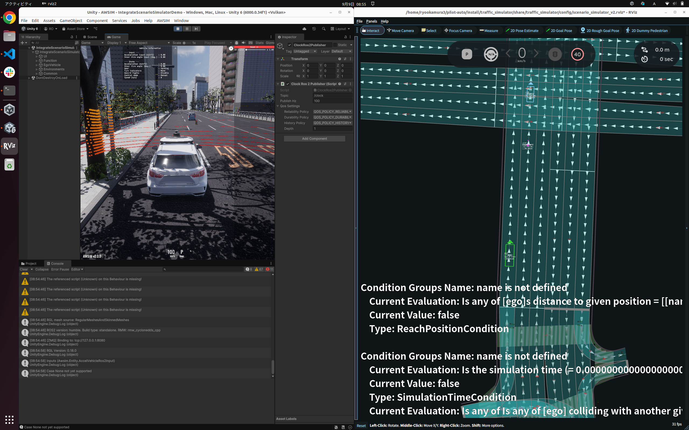
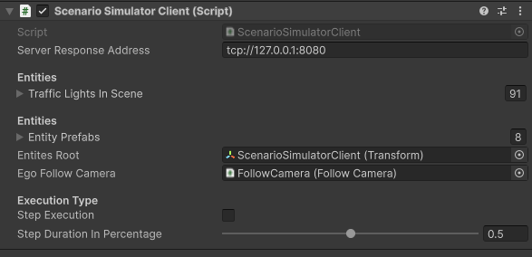
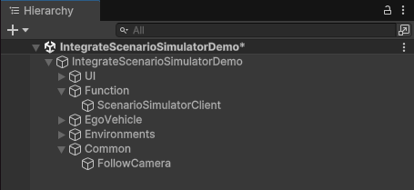
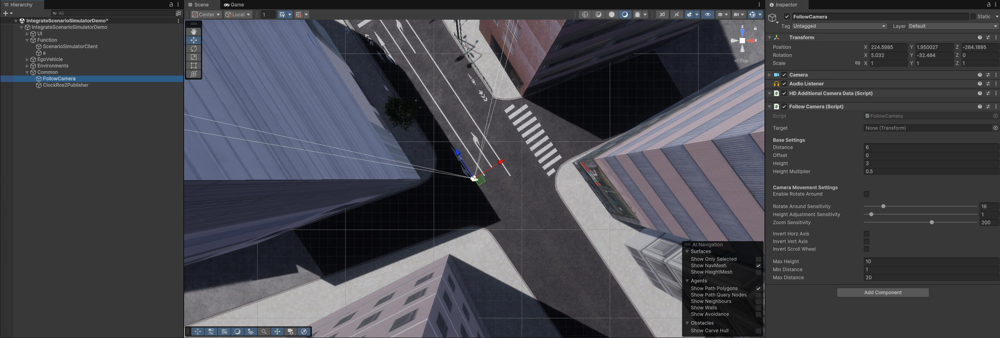
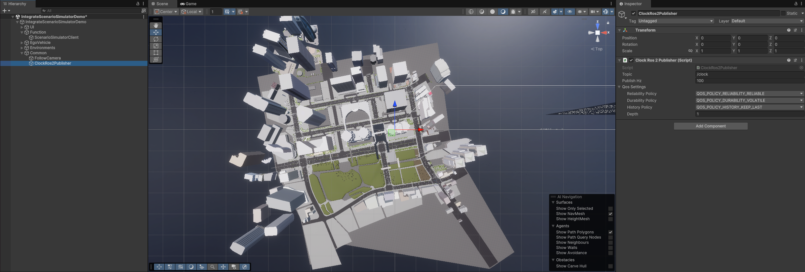

# ScenarioSimulatorConnection

## Abstract
`Scenario Simulator Connection` is a scene setting for connecting `Scenario simulator v2`. 
Spawn points (Spawnable Lanes) and spawnable vehicles can be configured using components and `Traffic Simulation` simulates traffic situation following configuration.

### Overview
`Scenario Simulator Connection` consists of the following components:

| Component | Description |
|---|---|
| TrafficSimulator | Collecting all traffic simulators and managing the spawning and simulating process. |
| NpcVehicleSpawner | Get Npc vehicle states and updating simulation steps. |
| NpcVehicleSimulator | Spawning random Npc vehicle in spawning lanes. |
| RandomTrafficSimulator | Managing lifecycle of NPCs and simulating NPC behaviours. |
| TrafficLane TrafficLight TrafficIntersection StopLine | Traffic entities. |
| NpcVehicle | Vehicle models (NPCs) controlled by `RandomTrafficSimulator`. |

### Configuration
`Scenario Simulator Connection` can be configured from `ScenarioSimulatorConnection` component.

The configurable elements are listed in the following table:

| Parameter | Description |
|---|---|
| Server Response Address | Tcp address to connect `Scenario simulator v2`. |
| Traffic Lights In Scene | Traffic lights which is controlled. |
| Entity Prefabs | List of Ego and Npc prefabs. Each element have identifier (`Asset Key`) and reference (`Prefab`). |
| Entites Root | Hierarchy where Npc is spawn. |
| Ego Follow Camera | Reference of `Follow Camera` object. |
| Step Execution | Enable the checkbox to perform step execution. |
| Step Duration In Percentage | On step execution, frames between each step. |

## Instruction
To use `Scenario Simulator Connection`, please follow the steps below.

For the preparation, the following must be prepared:

- 3D map (.fbx)
- lanelet map (.osm)

### 1. Placement and settings of `ScenarioSimulatorClient`
Please create and configure `ScenarioSimulatorClient` component.

Please create and configure `ScenarioSimulatorClient` component as the following:

1. Create empty `GameObject` (should be `Function/ScenarioSimulatorClient`)

2. Attach this object to `ScenarioSimulatorClient` component
3. Fill in `Entities Root` field with `ScenarioSimulatorClient` object itself

#### Configuration of `Entity Prefabs`
Please configure `Entity Prefabs` field as the following:

1. Fill in `Entity Prefabs` field of `ScenarioSimulatorClient` with vehicle prefabs what you want to use
    1. Fill `Asset Key` field with name for identifying prefab
    2. Fill `Prefab` field with Ego and Npc prefab
        1. Ego prefabs is in `Assets/Awsim/Prefabs/Entity/Npc/Vehicle/`
        2. Npc prefabs is in `Assets/Awsim/Scenes/IntegrateScenarioSimulatorDemo/`

#### Camera setting of `ScenarioSimulatorClient`
Please create and configure `FollowCamera` component as the following:

1. Create `Camera` object (should place on `Function/`)
2. Attach this object to `FollowCamera` component
3. Fill in `Ego FollowCamera` field of `ScenarioSimulatorClient` with this `Camera` object

### 2. `LaneletTrafficLight` settings
Please attach and configure `LaneletTrafficLight` script to all traffic light in the scene.

Please configure `LaneletTrafficLight` components as the following:

1. Attach `LaneletTrafficLight` to traffic light objects of all traffic light object in the scene
2. Modify `Bulb Material Config` as follow images 
vehicle raffic light 
 
pedestrian traffic light 

    1. If there are wrong order of bulb, modify each `Bulb Material Config`
3. Fill in `Traffic Lights In Scene` field of `ScenarioSimulatorClient` with all traffic light object in the scene

!!! info
    For detailed settings of `Bulb Material Config`, see [here](../../Entity/Infra/TrafficLight/index.md).

### 3. Load lanelet
`LaneletLoader` can load a lanelet map and set parameter of traffic rules to traffic lights. 
`LaneletLoader` can be performed by opening `AWSIM -> Common -> Load Lanelet` at the toolbar of Unity Editor.

Please use `LaneletLoader` as the following:

1. Fill in `Osm` field with a lanelet map (`.osm`) you prepared
2. Adjust `Waypoint settings` parameters for the loading process if needed
3. To load the lanelet map, please click `Load` button

The `Waypoint settings` parameters are listed in the following table:

| Parameter | Description |
|---|---|
| Resolution | Resolution of resampling. Lower values provide better accuracy at the cost of processing time. |
| Min Delta Length | Minimum length(m) between adjacent points. |
| Min Delta Angle | Minimum angle(deg) between adjacent edges. Lowering this value produces a smoother curve. |

### 4. Call methods of `ScenarioSimulatorClient` and `ClockRos2Publisher`
To enable `Scenario Simulator Client`, some methods of `ScenarioSimulatorClient` and `ClockRos2Publisher` should be called from callback of `MonoBehaviour`.

#### Placement of `ClockRos2Publisher`
Please create and configure `ScenarioSimulatorClient` component as the following:

1. Create empty `GameObject` (should be `Common/ClockRos2Publisher`)
2. Attach this object to `ClockRos2Publisher` component

#### Call methods
Please create or open class which is inherit `MonoBehaviour` and make field of `ScenarioSimulatorClient` and `ClockRos2Publisher`. 
Then, add description of calling method of `ScenarioSimulatorClient` and `ClockRos2Publisher`.

The method should be called are listed in the following table:

`ScenarioSimulatorClient`

| Method | Description |
|---|---|
| Initialize() | Should be called Start() callback. |
| OnUpdate() | Should be called Update() callback. |
| OnFixedUpdate() | Should be called FixedUpdate() callback. |

 `ClockRos2Publisher`

| Method | Description |
|---|---|
| Initialize() | Should be called Start() callback. |
| OnUpdate() | Should be called Update() callback. |

!!! info
    AWSIM includes `AutowareSimulationDemo` scene. 
    Please refer to: 
    * `Assets/Awsim/Scenes/IntegrateScenarioSimulatorDemo/IntegrateScenarioSimulatorDemo.cs` 
    * `Assets/Awsim/Scenes/IntegrateScenarioSimulatorDemo.unity` scene

