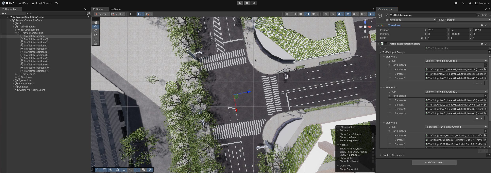
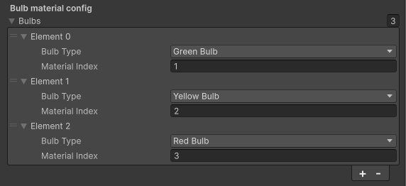
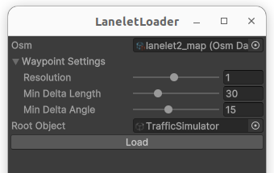
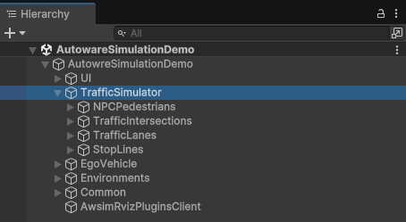
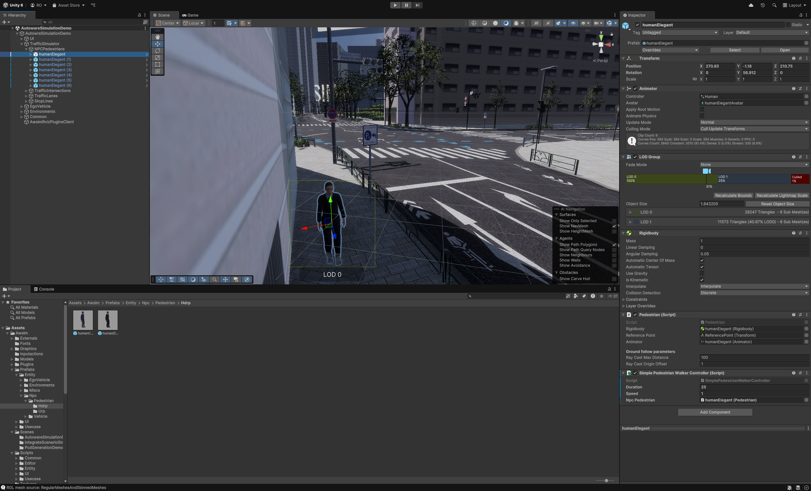

# Instruction
To use `Traffic Simulation`, please follow the steps below.

For the preparation, the following must be prepared:

- 3D map
- lanelet map (.osm)

## Place Traffic Simulator
Create empty `GameObject` (should be named `TrafficSimulator`). 
Attach this object to `TrafficSimulator` component.

(optional) To place objects which is generated later, you may creat empty objects named `TrafficIntersections` and `NPCPedestrians`.

## TrafficIntersection and LaneletTrafficLight settings
Please place intersection objects and attach `LaneletTrafficLight` script. 
Then, please you set traffic lights to intersection.

Please configure `TrafficIntersection` and `LaneletTrafficLight` components as the following:

1. Add a empty `GameObject` as a child object of `TrafficIntersections` hierarchy
    1. The `GameObject` should be named `TrafficIntersection.x`
    2. The `Transform` of `GameObject` should be set on the target intersection
2. Attach a `TrafficIntersection` component to the intersection game object
3. Attach `LaneletTrafficLight` to traffic light objects placed on the target intersection

4. Modify `Bulb Material Config` as follow images
vehicle raffic light 
 
pedestrian traffic light 

    1. If there are wrong order of bulb, modify each `Bulb Material Config`
5. Set traffic light objects attached `LaneletTrafficLight` in step. 3 to `TrafficLightGroups` in `TrafficIntersection`
    1. Traffic lights which should light same sequences should be set on same `TrafficLightGroups`
6. (optional) Modify the signal control pattern in `Lighting Sequences`

!!! warning
    Do not attach `LaneletTrafficLight` to traffic lights which are not set to `TrafficIntersection`. 
    It causes errors.

### Set right of ways on uncontrolled intersections
On intersections without traffic lights, it is needed to set the right of way of TrafficLane manually for the vehicles to operate properly.

Please configure `TrafficLane` components as the following:

1. Select a straight lane that should be right of way in the intersection

    1. The selected lane should be highlighted
2. Click the `Set RightOfWays` button to give the lane priority over other lanes

Please check if all lanes that intersect with the selected lane are highlighted yellow. 
This means that the right of way was applied correctly.

## Load lanelet
`LaneletLoader` can load a lanelet map and create `TrafficLane` and `StopLine`.
In addition, `LaneletLoader` set parameter of traffic rules to `TrafficLane`, `StopLine` and traffic lights. 
`LaneletLoader` can be performed by opening `AWSIM -> Random Traffic -> Load Lanelet` at the toolbar of Unity Editor.

Please use `LaneletLoader` as the following:
1. Fill in `Osm` field with a lanelet map (`.osm`) you prepared, `Root Object` field with a `TrafficSimulator` object. 
2. Adjust `Waypoint settings` parameters for the loading process if needed. 
3. To load the lanelet map, please click `Load` button.

The `Waypoint settings` parameters are listed in the following table:

| Parameter | Description |
|---|---|
| Resolution | Resolution of resampling. Lower values provide better accuracy at the cost of processing time |
| Min Delta Length | Minimum length(m) between adjacent points |
| Min Delta Angle | Minimum angle(deg) between adjacent edges Lowering this value produces a smoother curve |

`TrafficLane`, `StopLine` and `TrafficLight` will be generated and placed as child objects of the `Root Object`. 
You can check their visual representation by clicking consecutive elements in the scene hierarchy.

## TrafficSimulator setting

Please configure `TrafficSimulator` component as the following:

1. Fill in `Ego Vehicle` field with EGO vehicle
    1. Example: `EgoVehicle/Lexus RX450h 2015`
2. Change `Obstacle Layer Mask` and `Ground Layer Mask` field to `Everything`
3. Fill in `Traffic Intersections` field with `TrafficIntersection` objects
4. Fill in `Random Traffic Sims` field
    1. Fill in `Traffic Sim Npc Vehicle Prefab` field with vehicle prefabs what you want to spawn
        1. Prefabs is in `Assets/Awsim/Prefabs/Usecase/TrafficSimulation/`
    2. Fill in `Spawnable Traffic Lanes` field with `TrafficLane` where you want to spawn vehicles

For detailed settings, see [here](../Abstract/index.md#configulations)

## Place Pedestrian (optional)
You can place pedestrian NPCs if needed. 
Pedestrians can animated and walk around where they are placed. 
Direction which pedestrian start to walking can be set in `Transform` of it.

Please configure pedestrian NPCs as the following:

1. Place pedestrian prefabs on a scene
    1. Prefabs is in `Assets/Awsim/Prefabs/Entity/Npc/Pedestrian/`
    2. Pedestrians should be child object of `NPCPedestrians` hierarchy
2. Attach `SimplePedestrianWalkerController` component to pedestrians
3. (optional) Configure parameters of `SimplePedestrianWalkerController`

The parameters of `SimplePedestrianWalkerController` are listed in the following table:

| Parameter | Description |
|---|---|
| Duration | Duration at which the pedestrian walk |
| Speed | Speed at which the pedestian walk |

## Reference Components
To enable `Traffic Simulation`, please fill in following fields in `AutowareSimulationDemo.cs`.

Please fill in `Traffic Simulator` field in `AutowareSimulationDemo.cs` with a object which is attached `TrafficSimulator.cs`.

Please fill in `Simple Pedestrian Walker Controller` list in  `AutowareSimulationDemo.cs` with `Pedestrian` if you placed.