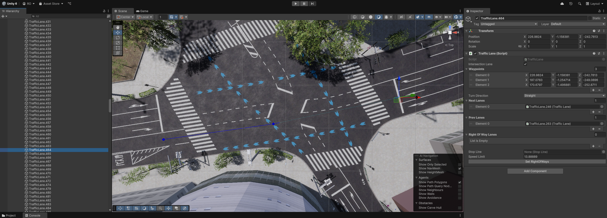
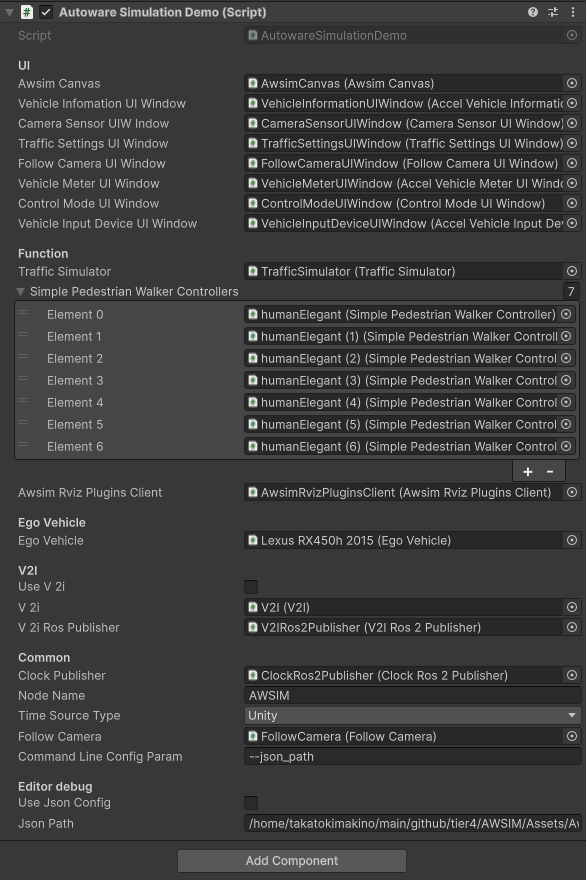

# TrafficSimulation

## Abstract
`Traffic Simulation` simulates traffic situation follow traffic rules. 
Spawn points (Spawnable Lanes) and spawnable vehicles can be configured using components and `Traffic Simulation` simulates traffic situation following configuration.

### Overview
`Traffic Simulation` consists of the following components:

| Component | Description |
|---|---|
| RandomTrafficSimulator | Managing lifecycle of NPCs and simulating NPC behaviours. |
| TrafficLane TrafficIntersection StopLine | Traffic entities. |
| NPCVehicle | Vehicle models (NPCs) controlled by `RandomTrafficSimulator`. |

``` mermaid
classDiagram
    Ramdom Traffic Simulator "1" o-- "1" NPC Vehicle Spawner
    Ramdom Traffic Simulator "1" o-- "1" NPC Vehicle Simulator
    NPC Vehicle Simulator --> Ego Vehicle:Get Transform
    NPC Vehicle Spawner --> NPC Vehicles:Spawn/Despawn
    NPC Vehicle Simulator --> NPC Vehicles:Set Position and Rotation
    Ramdom Traffic Simulator --> Environment Components:Get Data
    class Ramdom Traffic Simulator{
        - NPC Vehicle Spawner
        - NPC Vehicle Simulator
        + Get Data()
    }
    class NPC Vehicle Spawner{
        + Spawn/Despawn()
    }
    class NPC Vehicle Simulator{
        - Cognition Step
        - Decision Step
        - Control Step
        - Visualization Step
        + Get Transform()
        + Set Position and Rotation()
    }
    class Ego Vehicle{
    }
    class NPC Vehicles{
        + NPC 1
        + NPC 2
        ...
    }
    class Environment Components{
        + Traffic Light
        + Traffic Lane
        + Traffic Intersection
        + Stop Line
    }
```

### Configuration
`Traffic Simulation` can be configured from `TrafficSimulator` component.

The configurable elements are listed in the following table:

#### General Settings

| Parameter | Description |
|---|---|
| Ego Vehicle | Ego vehicle handler. If not set, the manager creates a dummy ego. This reference is also set automatically when the Ego spawns via the traffic simulator. |
| Seed | Seed value for random generator. |
| Traffic Intersections | The field that is set `TrafficIntersection` objects. `TrafficIntersection` to be set is controlled by `Traffic Simulation`. |

#### NPC Vehicle Settings

| Parameter | Description |
|---|---|
| Vehicle Config | Parameters for NPC vehicle control. `Sudden Deceleration` is a deceleration related to emergency braking. |
| Obstacle Layer Mask | The obstacle layer for raytracing the collision distances. |
| Ground Layer Mask | The Ground layer for raytracing the collision distances. |
| Max Vehicle Count | The maximum number of vehicles that can simultaneously live in the scene. Lowering this value results in less dense traffic but improves the simulator's performance. |
| Spawn Distance To Ego | The minimal distance between the EGO and the NPC to spawn. |

#### Debug

| Parameter | Description |
|---|---|
| Show Gizmos | Enable the checkbox to show all visualization using editor gizmos. |
| Show Yielding Phase | Enable the checkbox to show editor gizmos that visualize `Yielding Phase` of NPCs. |
| Show Obstacle Checking | Enable the checkbox to show editor gizmos that visualize `Obstacle Checking` phase of NPCs. |
| Show Spawn Points | Enable the checkbox to show editor gizmos that visualize `Spawn Points` where NPCs is generated. |

#### Random Traffic Sims

| Parameter | Description |
|---|---|
| Enable Simulation | Enable the checkbox to `Random Traffic Sims` which spawn NPC vehicles randomly. |
| TrafficSim Npc Vehicle Prefabs| Prefabs representing controlled vehicles. They must have `NPCVehicle` component attached. |
| Spawnable TrafficLanes | `TrafficLane` components where NPC vehicles can be spawned during traffic simulation. |
| Enable Spawn Count Limit | Enable the checkbox to limit of vehicle spawning. |
| Spawn Count Limit | The number of limit of vehicles spawning. |

### Gizmos
Gizmos are useful for checking current behavior of NPCs and its causes. 
Gizmos have a high computational load so please disable them if the simulation is laggy.

The visualizable elements are listed in the following table:

| Shape | Description |
|---|---|
| Rectangle | `Yielding Phase` of each NPCs to avoid colliding with the other NPCs. |
| Arrow | `Obstacle Checking` of each NPCs to stop in front of the obstacle. |
| Diamond | `Spawn Points` where NPCs is generated by `Random Traffic Sims`. |

## Instruction
To use `Traffic Simulation`, please follow the steps below.

For the preparation, the following must be prepared:

- 3D map
- lanelet map (.osm)

### 1. Place Traffic Simulator
Create empty `GameObject` (should be named `TrafficSimulator`). 
Attach this object to `TrafficSimulator` component.

(optional) To place objects which is generated later, you may creat empty objects named `TrafficIntersections` and `NPCPedestrians`.

### 2. TrafficIntersection and LaneletTrafficLight settings
Please place intersection objects and attach `LaneletTrafficLight` script. 
Then, please you set traffic lights to intersection.

Please configure `TrafficIntersection` and `LaneletTrafficLight` components as the following:

1. Add a empty `GameObject` as a child object of `TrafficIntersections` hierarchy
    1. The `GameObject` should be named `TrafficIntersection.x`
    2. The `Transform` of `GameObject` should be set on the target intersection
2. Attach a `TrafficIntersection` component to the intersection game object
3. Attach `LaneletTrafficLight` to traffic light objects placed on the target intersection

4. Modify `Bulb Material Config` as follow images
vehicle raffic light 
 
pedestrian traffic light 

    1. If there are wrong order of bulb, modify each `Bulb Material Config`
5. Set traffic light objects attached `LaneletTrafficLight` in step. 3 to `TrafficLightGroups` in `TrafficIntersection`
    1. Traffic lights which should light same sequences should be set on same `TrafficLightGroups`
6. (optional) Modify the signal control pattern in `Lighting Sequences`

!!! warning
    Do not attach `LaneletTrafficLight` to traffic lights which are not set to `TrafficIntersection`. 
    It causes errors.

#### Set right of ways on uncontrolled intersections
On intersections without traffic lights, it is needed to set the right of way of TrafficLane manually for the vehicles to operate properly.

Please configure `TrafficLane` components as the following:

1. Select a straight lane that should be right of way in the intersection

    1. The selected lane should be highlighted
2. Click the `Set RightOfWays` button to give the lane priority over other lanes

Please check if all lanes that intersect with the selected lane are highlighted yellow. 
This means that the right of way was applied correctly.

### 3. Load lanelet
`LaneletLoader` can load a lanelet map and create `TrafficLane` and `StopLine`.
In addition, `LaneletLoader` set parameter of traffic rules to `TrafficLane`, `StopLine` and traffic lights. 
`LaneletLoader` can be performed by opening `AWSIM -> Random Traffic -> Load Lanelet` at the toolbar of Unity Editor.

Please use `LaneletLoader` as the following:
1. Fill in `Osm` field with a lanelet map (`.osm`) you prepared, `Root Object` field with a `TrafficSimulator` object. 
2. Adjust `Waypoint settings` parameters for the loading process if needed. 
3. To load the lanelet map, please click `Load` button.

The `Waypoint settings` parameters are listed in the following table:

| Parameter | Description |
|---|---|
| Resolution | Resolution of resampling. Lower values provide better accuracy at the cost of processing time. |
| Min Delta Length | Minimum length(m) between adjacent points. |
| Min Delta Angle | Minimum angle(deg) between adjacent edges. Lowering this value produces a smoother curve. |

`TrafficLane`, `StopLine` and `TrafficLight` will be generated and placed as child objects of the `Root Object`. 
You can check their visual representation by clicking consecutive elements in the scene hierarchy.

### 4. TrafficSimulator setting

Please configure `TrafficSimulator` component as the following:

1. Fill in `Ego Vehicle` field with EGO vehicle
    1. Example: `EgoVehicle/Lexus RX450h 2015`
2. Change `Obstacle Layer Mask` and `Ground Layer Mask` field to `Everything`
3. Fill in `Traffic Intersections` field with `TrafficIntersection` objects
4. Fill in `Random Traffic Sims` field
    1. Fill in `Traffic Sim Npc Vehicle Prefab` field with vehicle prefabs what you want to spawn
        1. Prefabs is in `Assets/Awsim/Prefabs/Usecase/TrafficSimulation/`
    2. Fill in `Spawnable Traffic Lanes` field with `TrafficLane` where you want to spawn vehicles

For detailed settings, see [here](../Abstract/index.md#configulations)

### 5. Place Pedestrian (optional)
You can place pedestrian NPCs if needed. 
Pedestrians can animated and walk around where they are placed. 
Direction which pedestrian start to walking can be set in `Transform` of it.

Please configure pedestrian NPCs as the following:

1. Place pedestrian prefabs on a scene
    1. Prefabs is in `Assets/Awsim/Prefabs/Entity/Npc/Pedestrian/`
    2. Pedestrians should be child object of `NPCPedestrians` hierarchy
2. Attach `SimplePedestrianWalkerController` component to pedestrians
3. (optional) Configure parameters of `SimplePedestrianWalkerController`

The parameters of `SimplePedestrianWalkerController` are listed in the following table:

| Parameter | Description |
|---|---|
| Duration | Duration at which the pedestrian walk. |
| Speed | Speed at which the pedestian walk. |

### 6. Reference Components
To enable `Traffic Simulation`, please fill in following fields in `AutowareSimulationDemo.cs`.

Please fill in `Traffic Simulator` field in `AutowareSimulationDemo.cs` with a object which is attached `TrafficSimulator.cs`.

Please fill in `Simple Pedestrian Walker Controller` list in  `AutowareSimulationDemo.cs` with `Pedestrian` if you placed.