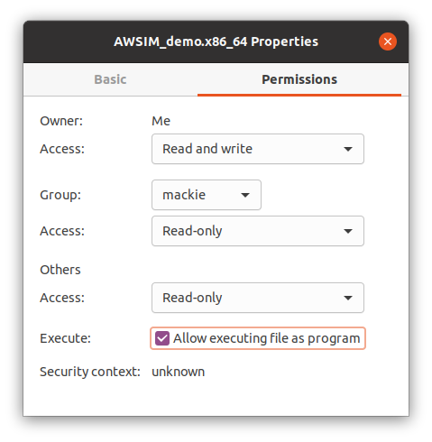
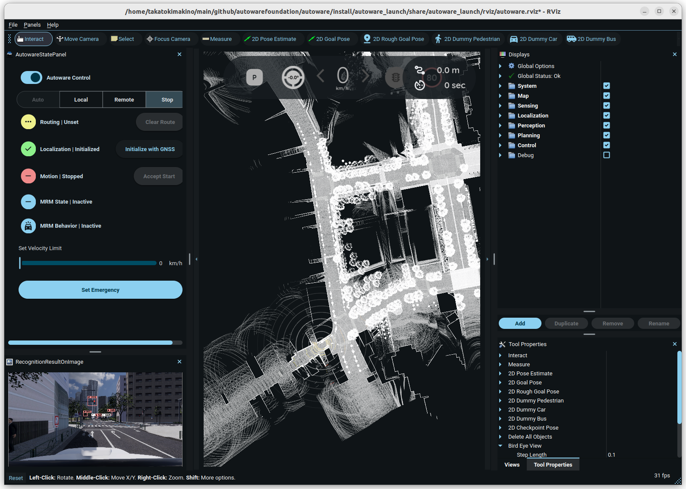
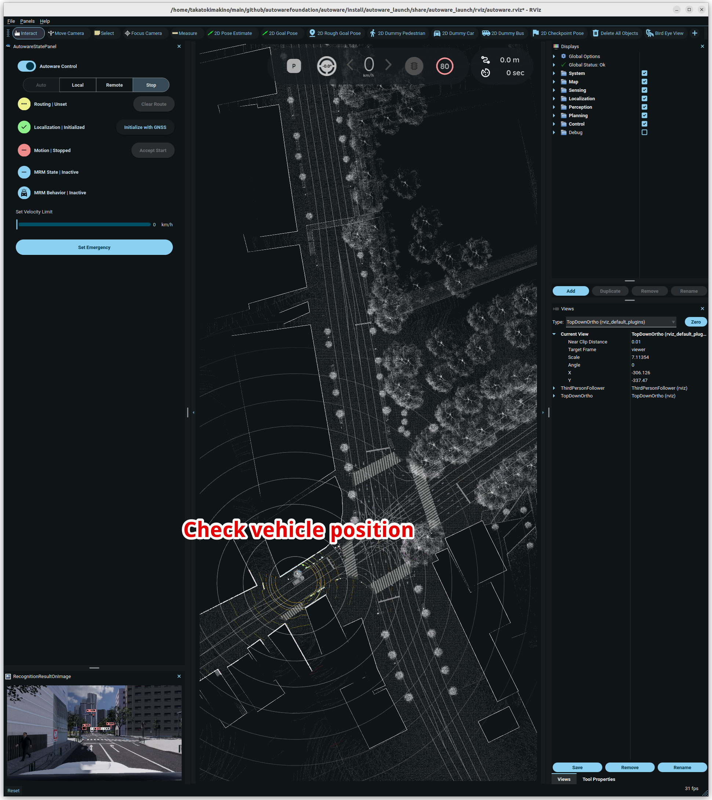
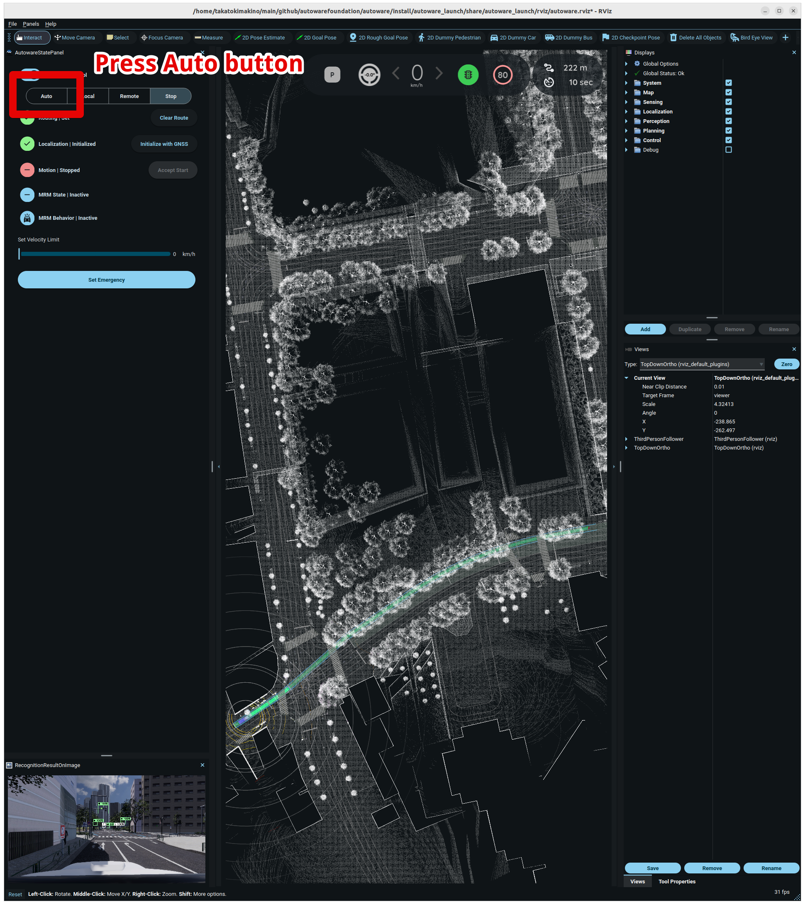

Below you can find instructions on how to setup the self-driving demo of AWSIM simulation controlled by Autoware. The instruction assumes using the Ubuntu OS.


AWSIM on the left, Autoware on the right.

## Demo contents 

|AWSIM demo contents||
|:--||
|Vehicle|Lexus RX450h 2015|
|Map|Japan tokyo nishi-shinjuku|
|Sensors|LiDAR * 1 <br> Camera * 1 <br> GNSS * 1 <br> IMU * 1 <br>|
|Traffic|Randomized traffic|
|ROS2|humble|

## 1. Preparation

Please make sure that your computer meets the following requirements in order to run the simulation correctly

!!! warning
    Requires Nvidia RTX graphics card as it uses raytracing.

|Required PC specs||
|:--||
|OS|Ubuntu 22.04|
|CPU|6 cores and 12 threads or higher|
|GPU|RTX2080Ti or higher|
|Memory|32GB or higher|
|Nvidia driver|570 or higher|


**Localhost settings**

The simulation requires appropriate network settings in order to communicate correctly between AWSIM and Autoware.  
Please follow the official Autoware documentation for configuring localhost:

[Autoware Documentation – DDS settings for ROS 2 and Autoware](https://autowarefoundation.github.io/autoware-documentation/main/installation/additional-settings-for-developers/network-configuration/dds-settings/)

!!! info
    A system restart is required for these changes to work.

## 2. Install Autoware

1. Clone [Autoware](https://github.com/autowarefoundation/autoware) and move to the directory.
    ```
    git clone https://github.com/autowarefoundation/autoware.git &&
    cd autoware
    ```

1. Use the `main` branch. Please check current branch.
    ```
    git branch
    ```
    ``` { .yaml .no-copy}
    * main
    ```
1. Configure the environment.
    ```
    ./setup-dev-env.sh

    ```
1. Create the `src` directory and clone external dependent repositories into it.
    ```
    mkdir src &&
    vcs import src < autoware.repos
    ```
1. Install dependent ROS packages.
    ```
    source /opt/ros/humble/setup.bash &&
    rosdep update &&
    rosdep install -y --from-paths src --ignore-src --rosdistro $ROS_DISTRO
    ```
1. Build the workspace.
    ```
    colcon build --symlink-install --cmake-args -DCMAKE_BUILD_TYPE=Release -DCMAKE_CXX_FLAGS="-w"
    ```

## 3. Download AWSIM demo

1. Install nvidia gpu driver (Skip if already installed).
    1. Add nvidia driver to apt repository.
    ```
    sudo add-apt-repository ppa:graphics-drivers/ppa &&
    sudo apt update
    ```
    1. Install the recommended version of the driver.
    ```
    sudo ubuntu-drivers autoinstall
    ```

        !!! info
            Version 570 or higher is recommended.

    1. Reboot your machine to make the installed driver detected by the system.
    ```
    sudo reboot
    ```

    1. Open terminal and check if nvidia-smi command is available and outputs summary similar to the one presented below.
    ```
    nvidia-smi 
    ```
    Check result.
    ```txt { .yaml .no-copy}
    Fri May  2 18:55:24 2025       
    +-----------------------------------------------------------------------------------------+
    | NVIDIA-SMI 570.124.06             Driver Version: 570.124.06     CUDA Version: 12.8     |
    |-----------------------------------------+------------------------+----------------------+
    | GPU  Name                 Persistence-M | Bus-Id          Disp.A | Volatile Uncorr. ECC |
    | Fan  Temp   Perf          Pwr:Usage/Cap |           Memory-Usage | GPU-Util  Compute M. |
    |                                         |                        |               MIG M. |
    |=========================================+========================+======================|
    |   0  NVIDIA GeForce RTX 4090        Off |   00000000:01:00.0  On |                  Off |
    |  0%   45C    P8             25W /  450W |    5920MiB /  24564MiB |      7%      Default |
    |                                         |                        |                  N/A |
    +-----------------------------------------+------------------------+----------------------+
    ```


1. Install vulkan graphics library (Skip if already installed).
    1. Update the environment.
    ```
    sudo apt update
    ```
    1. Install the library.
    ```
    sudo apt install libvulkan1
    ```

1. Download AWSIM demo.
    1. Download `AWSIM-Demo.zip`. 
    
        [Download AWSIM-Demo.zip](https://github.com/tier4/AWSIM/releases/download/v2.0.0/AWSIM-Demo.zip){ .md-button }

    1. Unzip the downloaded file.
    1. Make the `AWSIM-Demo.x86_64` file executable. Rightclick the `AWSIM-Demo.x86_64` file and check the `Execute` checkbox.
    
        
        or execute the command below.
    ```
    chmod +x <path to AWSIM folder>/AWSIM-Demo.x86_64
    ```
    
        !!! info
            If `AWSIM-Demo` is hefty, try [AWSIM-Demo-LightWeight](https://github.com/tier4/AWSIM/releases/download/v2.0.0/AWSIM-Demo-Lightweight.zip), a lightweight version.


## 4. Run AWSIM and Autoware

It is recommended to launch in the order of `1.AWSIM -> 2.Autoware`. Same procedure as the actual autoware's real vehicle.

1. Launch AWSIM demo
    1. Double-click `AWSIM-Demo.x86_64` to start it.
    

    1. Check ros2 topic list (optional)
    ```
    cd <autoware path> &&
    source install/setup.bash &&
    ros2 topic list
    ```
    Result. Topics that AWSIM demo pub/subs.
    ```txt { .yaml .no-copy}
    /clock
    /control/command/control_cmd
    /control/command/emergency_cmd
    /control/command/gear_cmd
    /control/command/hazard_lights_cmd
    /control/command/turn_indicators_cmd
    /parameter_events
    /rosout
    /sensing/camera/traffic_light/camera_info
    /sensing/camera/traffic_light/image_raw
    /sensing/gnss/pose
    /sensing/gnss/pose_with_covariance
    /sensing/imu/tamagawa/imu_raw
    /sensing/lidar/top/pointcloud_raw
    /sensing/lidar/top/pointcloud_raw_ex
    /vehicle/status/control_mode
    /vehicle/status/gear_status
    /vehicle/status/hazard_lights_status
    /vehicle/status/steering_status
    /vehicle/status/turn_indicators_status
    /vehicle/status/velocity_status
    ```

1. Launch Autoware

    1. Download `Shinjuku-Map.zip` and unzip them.  
        [Download Shinjuku-Map.zip](https://github.com/tier4/AWSIM/releases/download/v2.0.0/Shinjuku-Map.zip){ .md-button }
        
        !!! info
            Autoware-shinjuku-map.zip file contains map files for `pcd` and `osm`.

    1. Launch Autoware.

        ```
        source install/setup.bash &&
        ros2 launch autoware_launch e2e_simulator.launch.xml vehicle_model:=sample_vehicle sensor_model:=awsim_sensor_kit map_path:=<your mapfile location>
        ```

        !!! warning

            `<your mapfile location>` must be changed arbitrarily. When specifying the path the `~` operator cannot be used - please specify absolute full path.

        

1. Start autonomous driving !

    1. With both AWSIM and Autoware activated, check if the vehicle's self-position estimation is normal.

        

    1. Set the navigation goal for the vehicle.
    
        

    1. Check generate path and press "Auto" button.

        

    1. Enable self-driving.

        

        !!! info
            The default value of Autoware's maximum speed is 15 km/h. If you want more speed, you can modify it by entering the following command in the `autoware` directory.
            ```
            sed -i 's/max_vel: 4.17/max_vel: 22.2/' \
            ./src/launcher/autoware_launch/autoware_launch/config/planning/scenario_planning/common/common.paramyaml
            ```

        Learn more about demo simulation.

        [Demo details](../DemoDetails/index.md){ .md-button }


