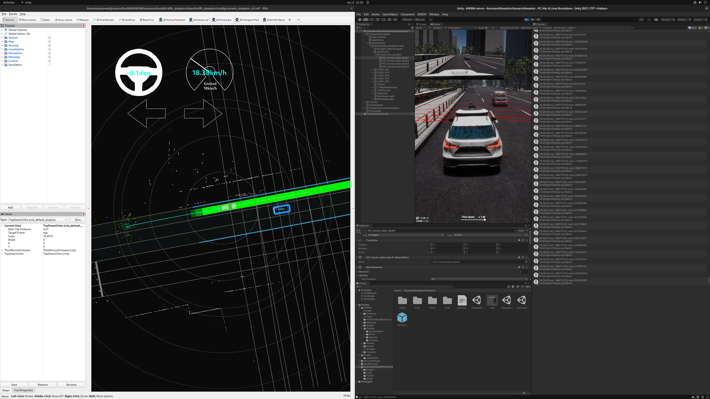

# Running AWSIM with `scenario_simulator_v2`

Below you can find instructions on how to setup the scenario execution using `scenario_simulator_v2` with AWSIM as a simulator
The instruction assumes using the Ubuntu OS.

## Prerequisites
Follow [Setup Unity Project tutorial](https://tier4.github.io/AWSIM/GettingStarted/SetupUnityProject/)

## Build Autoware with `scenario_simulator_v2`

In order to configure the Autoware software with the AWSIM demo, please:

1. Clone [Autoware](https://github.com/autowarefoundation/autoware) and move to the directory.
   ```
   git clone https://github.com/autowarefoundation/autoware.git
   cd autoware
   ```
2. Configure the environment. (Skip if Autoware environment has been configured before)
   ```
   ./setup-dev-env.sh
   ```
3. Create the `src` directory and clone external dependent repositories into it.
   ```
   mkdir src
   vcs import src < autoware.repos
   vcs import src < simulator.repos
   ```
4. Download `shinjuku_map.zip`
 
   [archive](https://drive.google.com/file/d/15aoZDEMnKL3cw8Zt_jh3zyiy_o35W0pr/view?usp=drive_link){.md-button .md-button--primary}
 
5. Unzip it to `src/simulator` directory
   ```
   unzip <Download directory>/shinjuku_map.zip -d src/simulator
   ```
6. Install dependent ROS packages.
   ```
   source /opt/ros/humble/setup.bash
   rosdep update
   rosdep install -y --from-paths src --ignore-src --rosdistro $ROS_DISTRO
   ```
7. Build the workspace.
   ```
   colcon build --symlink-install --cmake-args -DCMAKE_BUILD_TYPE=Release -DCMAKE_CXX_FLAGS="-w"
   ```

## Running the demo

1. Open AutowareSimulationScenarioSimulator.unity scene placed under `Assets/AWSIM/Scenes/Main` directory
2. Run the simulation by clicking `Play` button placed at the top section of Editor.
3. Launch `scenario_test_runner`.
   ```
   source install/setup.bash
   ros2 launch scenario_test_runner scenario_test_runner.launch.py                        \
   architecture_type:=awf/universe  record:=false                                         \
   scenario:='$(find-pkg-share scenario_test_runner)/scenario/sample_awsim.yaml'          \
   sensor_model:=awsim_sensor_kit  vehicle_model:=sample_vehicle                          \
   launch_simple_sensor_simulator:=false autoware_launch_file:="e2e_simulator.launch.xml" \
   initialize_duration:=60 port:=8080
   ```
   

## Troubleshooting

In case of problems, make sure that the [regular demo](https://tier4.github.io/AWSIM/GettingStarted/QuickStartDemo/) work well with the Autoware built above. Follow the [troubleshooting page](https://tier4.github.io/AWSIM/DeveloperGuide/TroubleShooting/) there if necessary.

## Appendix
- [AWSIM ROS2 topic list](../../Components/ROS2/ROS2TopicList/index.md)
