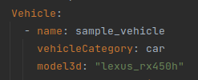

# AWSIM and scenario_simulator_v2 integration

This tutorial describes the AWSIM and `scenario_simulator_v2` connection and provides step by step instruction
on how to configure, run AWSIM and `scenario_simulator_v2` with sample scenario.

## Architecture

When working with `scenario_simulator_v2`, AWSIM has some of its features not utilized (crossed in the graph below)


### Scenario support

AWSIM utilizes `scenario_simulator_v2` as scenario interpretation tool

openSCENARIO features currently supported by scenario_simulator_v2 can be found [here](https://tier4.github.io/scenario_simulator_v2-docs/developer_guide/OpenSCENARIOSupport/).

TierIV developed its own format - TIER IV Scenario Format version 2.0 - built upon openSCENARIO adding additional features like parameters modifiers. More information can be found [here](https://tier4.github.io/scenario_simulator_v2-docs/developer_guide/TIERIVScenarioFormatVersion2/).

#### Limitations

Within openSCENARIO/TIER IV Scenario Format version 2.0 features, several features are not supported when working with AWSIM

1. Conventional traffic light publishing
2. Controller properties used by `attach_*_sensor`
   - `pointcloudPublishingDelay`
   - `isClairvoyant`
   - `detectedObjectPublishingDelay`
   - `detectedObjectPositionStandardDeviation`
   - `detectedObjectMissingProbability`
   - `randomSeed`

### ZeroMQ interface

scenario_simulator_v2 communicates with AWSIM using ZeroMQ interface. The protocol is documented [here](https://tier4.github.io/scenario_simulator_v2-docs/developer_guide/ZeroMQ/).

#### Limitations

AWSIM does not support ZeroMQ protocol fully.

Unsupported features are:

1. attach_lidar_sensor
2. attach_detection_sensor
3. attach_occupancy_grid_sensor
4. update_traffic_lights

If the scenario passing conditions depends on correct execution of one of the calls above, the scenario will not execute correctly.

## Scenario adaptation

To prepare the scenario to work with AWSIM add `model3d` field
 


`model3d` maps to `asset_id` from [this list](https://github.com/tier4/AWSIM-mirror/blob/pzyskowski/660/awsim-ss2-connection/Assets/ScenarioSimulatorConnector/asset_key_catalog.md). It can be edited as needed in Unity Editor as well (see point 3 in the next section).


## Preparing AWSIM scene to work with `scenario_simulator_v2`

1. Disable random traffic and any pre-spawned NPCs
2. Disable V2I traffic lights publishing
3. Add `ScenarioSimulatorConnector` prefab to the scene (located in `Assets/ScenarioSimulatorConnector`)
 
   
 
4. Configure the prefab instance
  - Add Ego Follow Camera object - most likely Main Camera

 
  - If necessary update the asset_id to prefab mapping
   


# Running AWSIM with `scenario_simulator_v2`

Below you can find instructions on how to setup the scenario execution using `scenario_simulator_v2` with AWSIM as a simulator
The instruction assumes using the Ubuntu OS.

## Prerequisites
1. Follow [Setup Unity Project tutorial](https://tier4.github.io/AWSIM/GettingStarted/SetupUnityProject/) on AWSIM-mirror repository

2. Checkout task branch (temporary - will not be necessary after everything is merged)
   ```
   git checkout awsim-ss2-connection
   ```

## Build Autoware with `scenario_simulator_v2`

In order to configure the Autoware software with the AWSIM demo, please:

1. Clone [Autoware](https://github.com/autowarefoundation/autoware) and move to the directory.
   ```
   git clone https://github.com/autowarefoundation/autoware.git
   cd autoware
   ```
2. Switch branche to `awsim-stable`.
   ```
   git checkout awsim-stable
   ```
3. Configure the environment. (Skip if Autoware environment has been configured before)
   ```
   ./setup-dev-env.sh
   ```
4. Create the `src` directory and clone external dependent repositories into it.
   ```
   mkdir src
   vcs import src < autoware.repos
   vcs import src < simulator.repos
   ```
   Steps below are temporary and will not be required after merging this branch into `master` and decision on where to put the `shinjuku_map` package

   Download `shinjuku_map.zip` [archive](https://drive.google.com/file/d/15aoZDEMnKL3cw8Zt_jh3zyiy_o35W0pr/view?usp=drive_link) and unzip it to `src/simulator` directory
   ```
   unzip <Download directory>/shinjuku_map.zip -d src/simulator
   ```
   Checkout task branch
   ```
   cd src/simulator/scenario_simulator
   git checkout pzyskowski/660/ss2-awsim-connection
   cd ../../..
   ```
5. Install dependent ROS packages.
   ```
   source /opt/ros/humble/setup.bash
   rosdep update
   rosdep install -y --from-paths src --ignore-src --rosdistro $ROS_DISTRO
   ```
6. Build the workspace.
   ```
   colcon build --symlink-install --cmake-args -DCMAKE_BUILD_TYPE=Release -DCMAKE_CXX_FLAGS="-w"
   ```

## Running the demo

1. Open AutowareSimulationScenarioSimulator.unity scene placed under `Assets/AWSIM/Scenes/Main` directory
2. Run the simulation by clicking `Play` button placed at the top section of Editor.
3. Launch `scenario_test_runner`.
   ```
   source install/setup.bash
   ros2 launch scenario_test_runner scenario_test_runner.launch.py                        \
   architecture_type:=awf/universe  record:=false                                         \
   scenario:='$(find-pkg-share scenario_test_runner)/scenario/sample_awsim.yaml'          \
   sensor_model:=awsim_sensor_kit  vehicle_model:=sample_vehicle                          \
   launch_simple_sensor_simulator:=false autoware_launch_file:="e2e_simulator.launch.xml" \
   initialize_duration:=60 
   ```
   

## Troubleshooting

If Autoware fails to localize (but localize on a [regular demo](https://tier4.github.io/AWSIM/GettingStarted/QuickStartDemo/)), as a temporary solution
try to comment out line [in which initial pose to Autoware is sent](https://github.com/tier4/scenario_simulator_v2/blob/pzyskowski/660/ss2-awsim-connection/external/concealer/src/field_operator_application_for_autoware_universe.cpp#L294) 
or increase the [interval between sends](https://github.com/tier4/scenario_simulator_v2/blob/pzyskowski/660/ss2-awsim-connection/external/concealer/src/field_operator_application_for_autoware_universe.cpp#L295C16-L295C16)

In case of any other problems, make sure that the [regular demo](https://tier4.github.io/AWSIM/GettingStarted/QuickStartDemo/) work well first.

## Appendix
- [AWSIM ROS2 topic list](../../Components/ROS2/ROS2TopicList/index.md)
